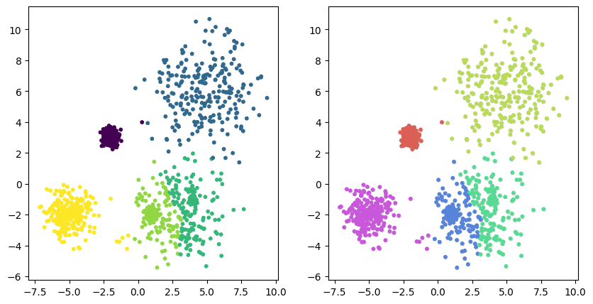

# sklearn_optics_tools
Handy functions to work with sklearn OPTICS algorithm to plot and cluster the data.

# Requirements
In order to use this file, you just need to have installed the packages in `requirements.txt` and put the file `sklearn_optics_tools.py` in your working folder.

# Example of use

In this tutorial, we give and overview of the tools that exist for working with OPTICS. First we will upload the sample data, we will provide an analogous example to that provided in the sklean [tutorial](https://scikit-learn.org/stable/auto_examples/cluster/plot_optics.html#sphx-glr-auto-examples-cluster-plot-optics-py).

We import the packages we are going to use.


```python
import matplotlib.gridspec as gridspec
import matplotlib.pyplot as plt
import numpy as np

from sklearn.cluster import OPTICS
```

And we import the functions from the tools.


```python
from sklearn_optics_tools import *
```

## Sample data generation

This uses the same distribution from the sklean [tutorial](https://scikit-learn.org/stable/auto_examples/cluster/plot_optics.html#sphx-glr-auto-examples-cluster-plot-optics-py).


```python
np.random.seed(0)
n_points_per_cluster = 250

C1 = [-5, -2] + 0.8 * np.random.randn(n_points_per_cluster, 2)
C2 = [4, -1] + 0.1 * np.random.randn(n_points_per_cluster, 2)
C3 = [1, -2] + 0.2 * np.random.randn(n_points_per_cluster, 2)
C4 = [-2, 3] + 0.3 * np.random.randn(n_points_per_cluster, 2)
C5 = [3, -2] + 1.6 * np.random.randn(n_points_per_cluster, 2)
C6 = [5, 6] + 2 * np.random.randn(n_points_per_cluster, 2)
X = np.vstack((C1, C2, C3, C4, C5, C6))
```


```python
plt.scatter(X[:,0],X[:,1],s=1)
plt.show()
```


    

    


## Cluster analysis using OPTICS and the extension tools

The first step is to run the OPTICS class and fit the model.


```python
model = OPTICS(min_samples=80, min_cluster_size=0.5)
model.fit(X)
```

We now have to create the hierarchical tree of clusters. This method follows the specifications described in the original (OPTICS paper)[https://dl.acm.org/doi/abs/10.1145/304181.304187].


```python
tree_clusters = optics_tree(model) 
```

We can plot the results of the reachability plot and the clustering hierarchy.

There are a few ways in which you can plot the clusters:

 - "hierarchy"
 - "relative reachability"
 - "cluster size"


```python
fig, ax = plt.subplots(2,2,figsize=[10,10])

optics_plot_reachability(model,tree_clusters,ax[0,0])
optics_plot_tree(tree_clusters,ax[1,0],flavor="hierarchy")
optics_plot_tree(tree_clusters,ax[0,1],flavor="relative_reachability")
optics_plot_tree(tree_clusters,ax[1,1],flavor="cluster_size")

plt.show()
```


    

    


You can get the the labels of the clusters in the leaves, the colors and plot them. 


```python
labels = optics_get_labels(tree_clusters)
colors = optics_get_colors(tree_clusters)
```


```python
fig, ax = plt.subplots(1,2,figsize=[10,5])

# labels is the numeric value but does not assigna color similar to the hierarchical mappings
ax[0].scatter(X[:,0], X[:,1], s=10, c=labels)

# colors keep the hierarchy of colors
ax[1].scatter(X[:,0], X[:,1], s=10, color="lightgray")
ax[1].scatter(X[:,0], X[:,1], s=10, color=colors)

plt.show()
```


    

    


## Impute outliers

In case you do not want outliers, you can label all cells using a KneighborsClassifier.


```python
labels_imputed = optics_label_outliers(X,labels)
colors = optics_get_colors(tree_clusters, labels=labels_imputed)
```


```python
fig, ax = plt.subplots(1,2,figsize=[10,5])

# labels is the numeric value but does not assigna color similar to the hierarchical mappings
ax[0].scatter(X[:,0], X[:,1], s=10, c=labels_imputed)

# colors keep the hierarchy of colors
ax[1].scatter(X[:,0], X[:,1], s=10, color="lightgray")
ax[1].scatter(X[:,0], X[:,1], s=10, color=colors)

plt.show()
```


    

    


# Pruning the tree

You can get other hierarchies by pruning the tree cluster. For example, looking at the clustering hierarchy, we can remove hierarchy at cluster 4.


```python
tree_prunned = optics_prune_tree(tree_clusters, cluster_hierarchy_max = 4)
```


```python
labels_pruned = optics_get_labels(tree_prunned)
colors_pruned = optics_get_colors(tree_prunned)
```


```python
fig, ax = plt.subplots(1,2,figsize=[10,5])

# labels is the numeric value but does not assigna color similar to the hierarchical mappings
ax[0].scatter(X[:,0], X[:,1], s=10, c=labels_pruned)

# colors keep the hierarchy of colors
ax[1].scatter(X[:,0], X[:,1], s=10, color="lightgray")
ax[1].scatter(X[:,0], X[:,1], s=10, color=colors_pruned)

plt.show()
```


    

    

